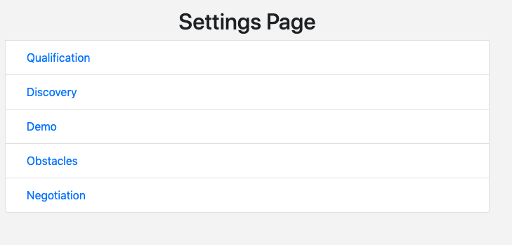

# QUALIFIED MVP BACKSTORY

[Link to Live Demo App ](https://nifty-hugle-cf06c5.netlify.com)
This MVP was inspired by Salesforce, Marketo, and Outreach.io

This project was inspired when I was a software sales rep. I wish I had a tool that graded the quality of an opportunity with numerical, quantifable metrics versus gut feelings about an opportunity.

Something similar to how Marketo grades marketing leads, similar to how Salesforce is a CRM, and lastly, similar to a sales acceleration tool like Outreach.io

# PROJECT JOURNEY INSIGHTS

1. [Link to Live Demo App ](https://nifty-hugle-cf06c5.netlify.com)
2. [Qualified Product Development Roadmap Google Sheet ](https://docs.google.com/spreadsheets/d/1rEqcpEd8b2sCHKsGvMcy7s1Rh6V66-jFo1X5c5EcSOE/edit?usp=sharing)
3. [Trello Board: Project Management](https://trello.com/b/Wxv7FAQB/qualified-react-crm)
4. [My Blog ](https://www.mraddoil.com/2018/12/23/is-software-sales-right-for-you/)

# APP OVERVIEW

## 1. Opportunity

Create an opportunity with multiple sales stages that have different stage scores, questions, etc

## 2. Search Tech News

During your sales conversation, directly search tech company news while you take sales notes, use the searched news in your conversations

## 3. Sales Conversation Form

This is the form where the app guides you in what questions you should ask, sales information points, and the category type of the questions (customer goals = read only, pain points = read only, objections = will minus points)

## 4. Opportunity Info Dash

This dashboard shows all the aggregated goals, pain points, and objections you've gather during your sales conversations and they show up on every stage so you can focus on what's most important for the customer. Especially during the negotiation stage.

## 4. Objections Info Tab

This objections tab is extremely helpful in all stages. When you resolve an objection, cross it out and gain points back. This is extremely helpful during the negotiation stage.

## 5. All Opportunity Progress Bar

This dashboard shows the total score of the opportunity you are working on. This point allows you to determine whether you are at a healthy point at the current stage you are, therefore, you won't waste your time on opportunities that are not high in points: not worth the time.

## 6. Current Stage Progress Bar

This dashboard shows you the point health of your current sales stage.

## 7. Settings Page

This settings page allows you to customize questions, points, etc of each sale stage

## 8. Stage Settings

This stage settings page allows you to customize questions, points, etc of that stage

# TECHNOLOGIES USED

1. HTML5
2. CSS3
3. Javascript
4. Bootstrap
5. React
6. Redux

# 3RD PARTY API

1. [News API](https://newsapi.org/s/google-news-api)

#LIBRARIES USED

1. [React BootStrap](https://react-bootstrap.github.io/)
2. [Immutable](https://github.com/immutable-js/immutable-js)
3. [Reselect](https://github.com/reduxjs/reselect)

# TESTING TOOLS

1. React Chrome Extension
2. Redux Chrome Extension
3. Chrome Dev Tools
4. Jest, Enzyme

## CHALLENGES

1. Priority Management: Figuring out which features are worth the time and core to product. Ex. Whether the Settings page was worth making in order to create an MVP that was sufficient to demo a proof of concept.
2. Time Management: Keeping app within 2 weeks scope
3. Focus: Dedicating more time on one particular skill, specifically, JavaScript over other technologies. Therefore, for styling and other features, delegate it to other libraries or frameworks.
4. Ignorance and Inexperience: Unsure of what actual technologies, time, and effort is needed to create an MVP that is sufficient for a proof of concept
5. Drinking Out Of Firehose: This project, I was stretched a lot by trying out Immutable.js based on my mentor's recommendation. It was hard to rely on this dependency because it affected the entire codebase in the redux state. However, it did teach me the importance of immutabilty in JavaScript. Next, learning how to use Redux selectors to select specific data from the Redux store.

## FUTURE IMPROVEMENTS

1. Database: Add database to allow for unique user profiles and their respective sales account. During project, did consider using Firebase
2. Authentication: To allow users to login via Google OAuth, etc
3. Create Full Stack App: Build an actual backend to reduce everything being burdened on the frontend

# MENTORS

1. [Justin Tieu - Software Engineer Eversight](https://www.linkedin.com/in/justintieu/)
2. [Mario Retana Rojas - Software Engineer Akurey ](https://www.linkedin.com/in/marioretana/) (Primary Mentor)
